# <center>TMS</center>

## <center>Home Work #4</center>

1. Добавил диск ``/dev/sdc`` (2Gb) к ВМ
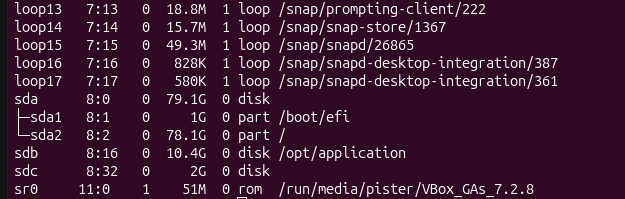
2. Отмонтировал диск, который монтировал в предыдущем ДЗ
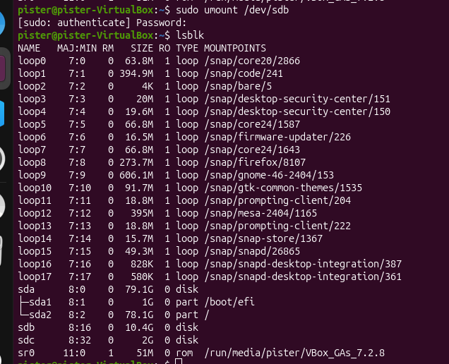
3. С помощью fdisk разбил его на три раздела(3GB+3GB+4GB)

4. Из нового диска и двух разделов из п2 собрать volume group с именем vgdata

- Создал физические тома(PV) командой:
``pvcreate /dev/sdc /dev/sdb1 /dev/sdb2``
- Создал Volume Group командой:
``vgcreate vgdata /dev/sdc /dev/sdb1 /dev/sdb2``

- Проверил:
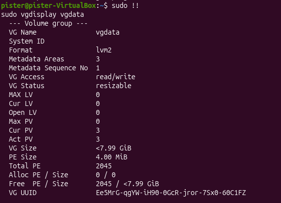
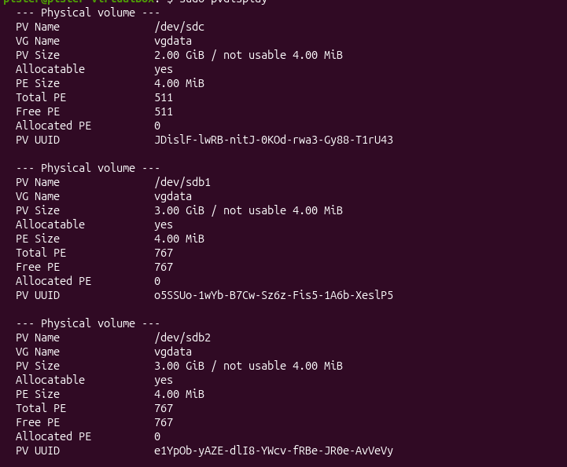

5. На volume group vgdata создаю два logical volume размера mysql(3GB) и postgres (3GB)
```bash
   lvcreate -n mysql -L 3G vgdata
   lvcreate -n postgres -L 3G vgdata
```
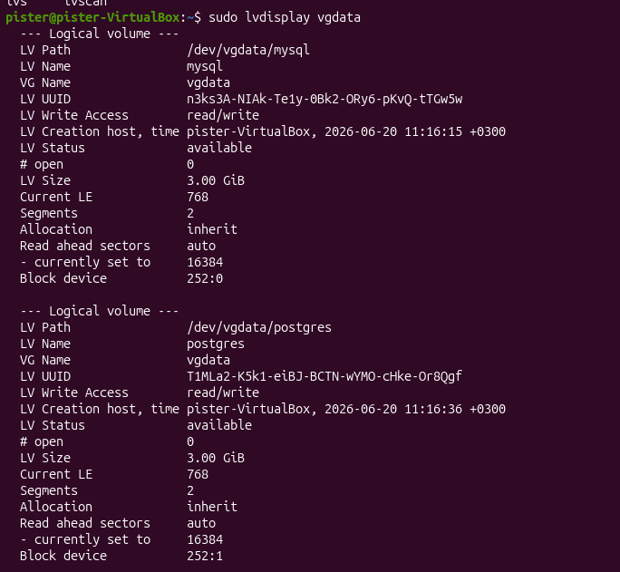


6. Создать директории ``/opt/mysql`` и ``/opt/postgres`` и монтирую в них logical volume. Но сразу получаю ошибку, что на логических томах нет ФС
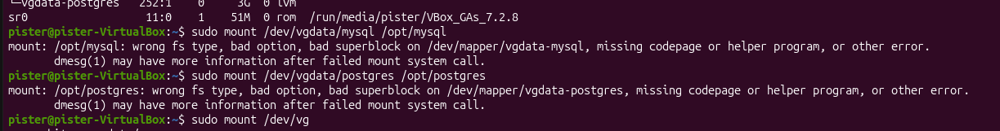
7. Создаю ФС на логических томах
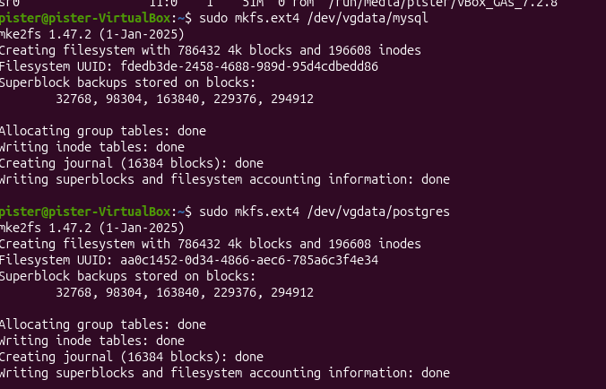
8. Монтирую logical volume в ``/opt/mysql`` и ``/opt/postgres``
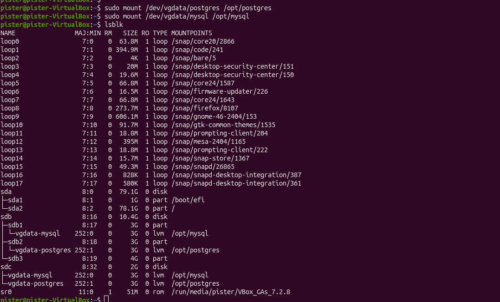
9. Добавляю в volume group третий раздел диска ``/dev/sdb`` 
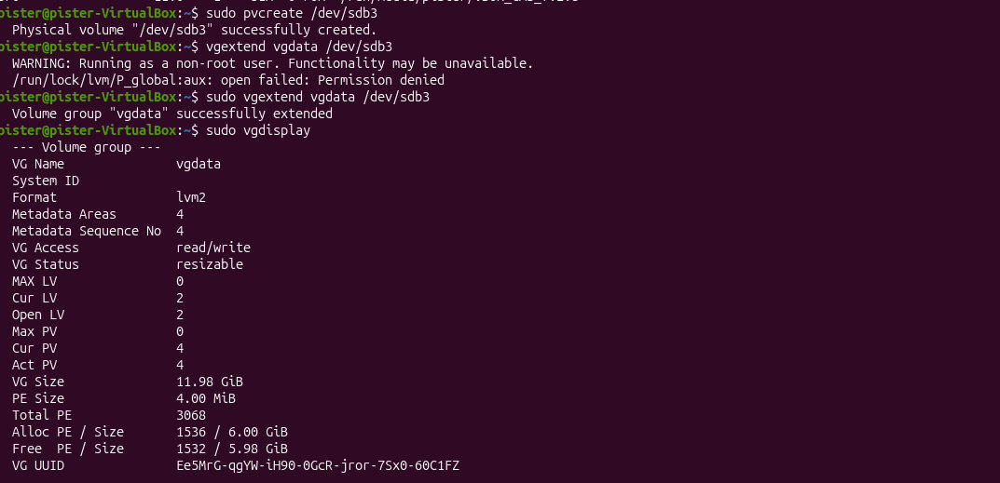
- Проверяю:
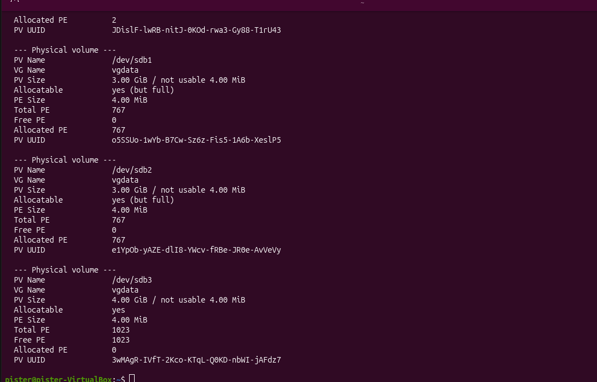
10. Расширяю logical volume mysql на весь доступный объем volume group
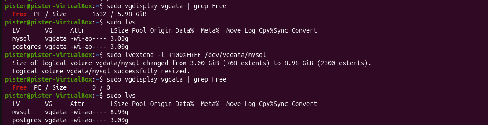
- Смотрю вывод lsblk и проверяю
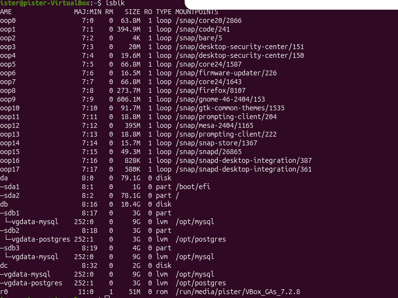